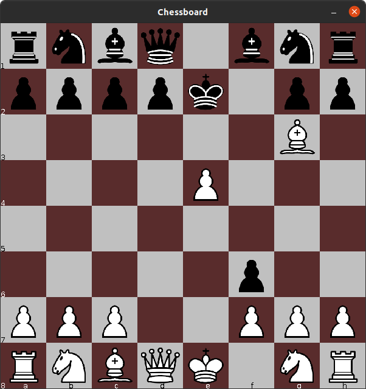

# Java Chessboard

Currently, this is just a chessboard. You cannot move pieces or do anything.

## Compilation and running
```
cd src
javac *.java -d ..
cd ..
java App
```
Tested on Ubuntu 20.04 64-bit

## Image
